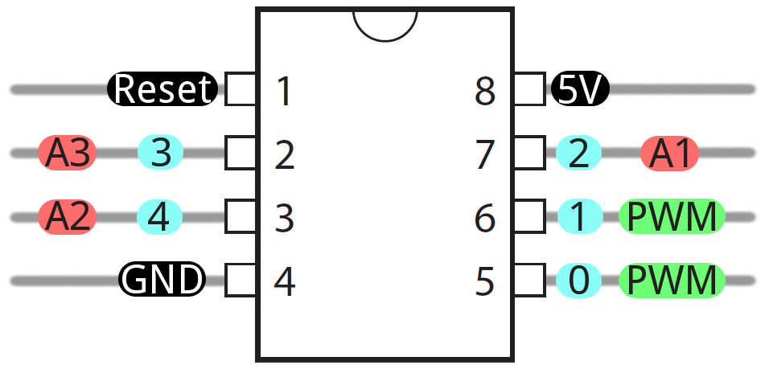
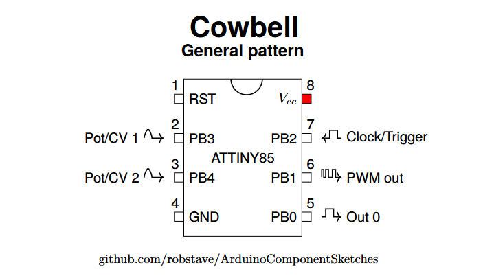

# Attiny85 Latex generator

Attiny85 LaTeX Builder is a Golang-based tool designed to generate LaTeX documents from JSON configurations. The primary goal of this project is to assemble detailed circuit diagrams and documentation for the Attiny85 microcontroller using predefined LaTeX templates and dynamic data insertion.

It takes a json file that specifies how to draw the image and translates it to a .tex file.

You still have to turn that to pdf or whatever.  I use Overleaf to inspect and just snapshot the image.  www.overleaf.com

I suppose in the long run, it would be nice to just have the json files in github and have a service that batch generates the images as needed.

## Problem

I love this image 

I have been using inkscape to draw a similar deal for years.  It tedious and error prone.

Latex is AWESOME.  So I created an app that takes in a json file like this

```json
{
    "title": "Cowbell",
    "subtitle": "General pattern",
    "tag": "github.com/robstave/ArduinoComponentSketches",
    "pin2": {
        "pin":2,
        "pintype": "AIN",
        "pintext": "Pot/CV 1"
    },
    "pin3": {
        "pin":3,
        "pintype": "AIN",
        "pintext": "Pot/CV 2"
    },
    "pin5": {
        "pin":5,
        "pintype": "DOUT",
        "pintext": "Out 0"
    },
    "pin6": {
        "pin":6,
        "pintype": "PWM",
        "pintext": "PWM out"
    },
    "pin7": {
        "pin":7,
        "pintype": "DIN",
        "pintext": "Clock/Trigger"
    }
}


```

Resulting in a tex file  




## Issues

It does NOT create images.  It creates the .tex file.
And sometimes the centering is not perfect.

I use Overleaf to view and tweak as needed

www.overleaf.com
 

## Features

- **Dynamic LaTeX Generation:**  
  Assemble LaTeX documents using embedded templates based on JSON input data.
  
- **Modular Template System:**  
  Supports customizable templates for different parts of the document, including chip body, pins, and various signal types (analog, digital, PWM).

- **JSON-Driven Configuration:**  
  Easily specify circuit details such as pin configurations and labels via a JSON file.

- **Embedded Templates:**  
  Leverages the Go `embed` package to include LaTeX template files directly within the compiled binary.

---

## Project Structure

```
attiny85-latex/
├── cmd/
│   └── attiny85-latex/
│       └── main.go             # Entry point of the application
├── internal/
│   ├── data/
│   │   ├── data.go             # Data structures for the JSON schema
│   │   ├── embed.go            # Embedded LaTeX template files
│   │   ├── pins.go             # Utility for pin value computations
│   │   └── templates/          # Directory containing all LaTeX templates
│   │       ├── attiny85.tex
│   │       ├── body.tex
│   │       ├── east-analogin.tex
│   │       ├── east-digitalin.tex
│   │       ├── east-digitalout.tex
│   │       ├── east-pwmout.tex
│   │       ├── west-analogin.tex
│   │       ├── west-digitalin.tex
│   │       └── west-digitalout.tex
│   ├── jsonparse/
│   │   └── parse.go            # JSON file reading and parsing utilities
│   └── latex/
│       ├── latex.go            # Main LaTeX generation logic
│       ├── pin.go              # Template processing functions for pin images
│       └── pinimages.go        # Functions to process various LaTeX sub-templates
├── output/
│   └── output.tex              # Generated LaTeX output (created at runtime)
└── README.md                   # This file
```

---

## Installation

1. **Clone the Repository:**

   ```bash
   git clone https://github.com/your-username/attiny85-latex.git
   cd attiny85-latex
   ```

2. **Build the Application:**

   Ensure you have [Go](https://golang.org/) installed (version 1.16+ is required for embed support):

   ```bash
   go build -o attiny85-latex ./cmd/attiny85-latex
   ```

---

## Usage

The application generates a LaTeX document based on the provided JSON configuration.

1. **Prepare Your JSON File:**  
   Create a JSON file with the required structure, for example:

   ```json
   {
    "title": "Cowbell",
    "subtitle": "General pattern",
    "tag": "github.com/robstave/ArduinoComponentSketches",
    "pin2": {
        "pin":2,
        "pintype": "AIN",
        "pintext": "Pot/CV 1"
    },
    "pin3": {
        "pin":3,
        "pintype": "AIN",
        "pintext": "Pot/CV 2"
    },
    "pin5": {
        "pin":5,
        "pintype": "DOUT",
        "pintext": "Out 0"
    },
    "pin6": {
        "pin":6,
        "pintype": "PWM",
        "pintext": "PWM out"
    },
    "pin7": {
        "pin":7,
        "pintype": "DIN",
        "pintext": "Clock/Trigger"
    }

 
}


   ```

pins 4 and 8 are reserved for Ground and V+

2. **Run the Application:**

   ```bash
   ./attiny85-latex -json path/to/your/config.json
   ```

   you can also just run it without building

   ```bash
   go run cmd/attiny85-latex/main.go -json examples/cowbell.json
   ```

   After running, the generated LaTeX document will be saved in the `output/` directory (e.g., `output/output.tex`).

3. **Compile the LaTeX Document:**

   Use your preferred LaTeX engine to compile the generated file into a PDF:

  
  Note...these use some other libraries so I just
  paste it into overleaf.


---

## Customization

- **Templates:**  
  Modify the LaTeX template files in `internal/data/templates/` to adjust the layout or styling of the final document. Be sure to update any placeholder variables as needed.

- **Pin Configurations:**  
  Adjust the pin definitions in the JSON configuration to reflect any changes in your circuit design.

- **Extending Functionality:**  
  The application’s modular design allows you to add support for additional microcontrollers or custom document elements.  Im not really maintaining this
  though so fork away and have at it.

---

## Contributing

In a bit of a time crunch, so I will not be maintaining this too much. We will see.  If it really is working out
for you, fork and let it take on a life of its own.

## License

This project is licensed under the [MIT License](LICENSE).

---

 

Happy TeXing!